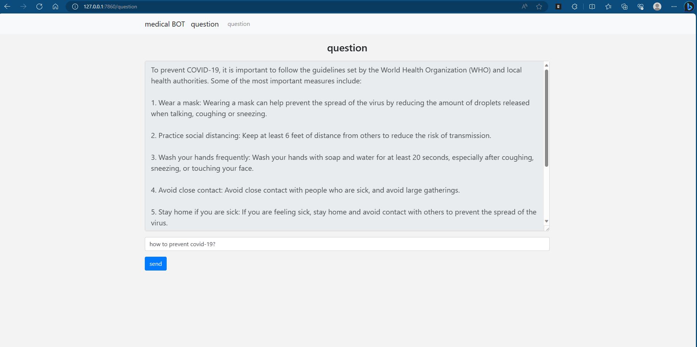
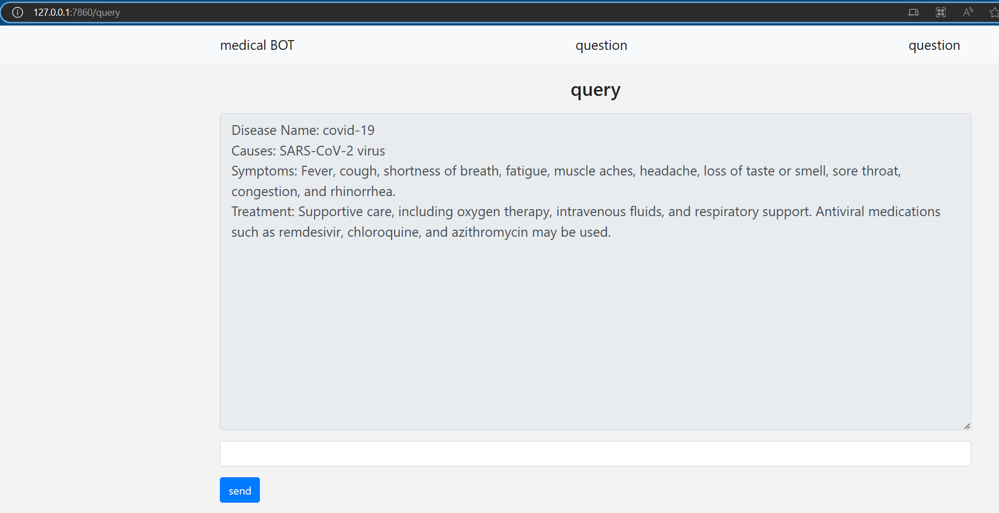

# Content management and DL - team project

## Large language model with digital library for medical

I've found a [Medical LLaMA-13B Model](https://huggingface.co/shibing624/ziya-llama-13b-medical-merged), which can response the medical problem wonderful.

The model needs at least 14G+ GPU memory when load_in_8bit, 40G+ when load by float32.

pip install requirements.txt -r

run medical_llama.py to directly chat or query.

run app.py to chat or query in a web.

run ex.py to generate the medical transcripts results.

#### code framework

app.py :  a web server

medical_llama.py : the medical llama model

templates : html objects

static : css/images/js
